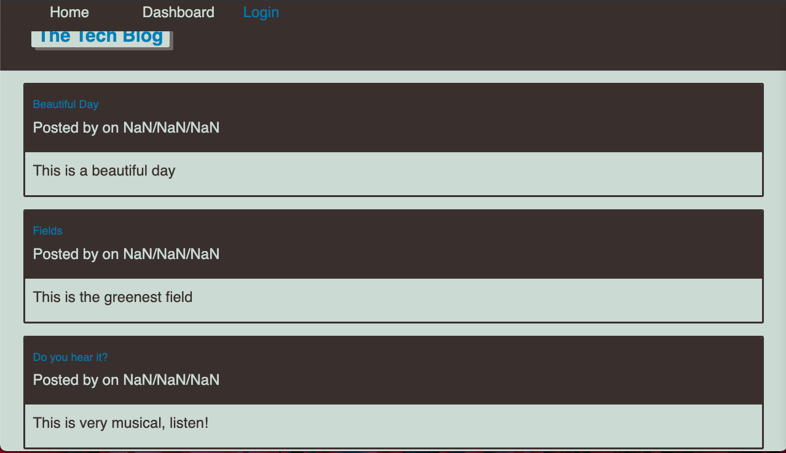

# Tech Blog

## Description

This is a project created for the University of Arizona Coding Bootcamp class. The programme is a CMS-style blog site, similar to a Wordpress site, where developers may create blog articles and comment on the writings of other developers. The app's architectural framework follows the MVC paradigm, with Handlebars.js as the template language, Sequelize as the ORM, and the express-session npm package for authentication.

## Table of Contents

- [Description](#description)
- [Usage](#usage)
- [Live view](#liveview)

## Usage

Clone the repo, navigate to the root folder, run the following commands from the CLI:

Run Test;  
`npm run test`

Seed DB;  
`npm run seed`

Start Server;  
`npm start server`

## Accepted Criteria

- GIVEN a CMS-style blog site
- WHEN I visit the site for the first time
- THEN I am presented with the homepage, which includes existing blog posts if any have been posted; navigation links for the homepage and the dashboard; and the option to log in
- WHEN I click on the homepage option
- THEN I am taken to the homepage
- WHEN I click on any other links in the navigation
- THEN I am prompted to either sign up or sign in
- WHEN I choose to sign up
- THEN I am prompted to create a username and password
- WHEN I click on the sign-up button
- THEN my user credentials are saved and I am logged into the site
- WHEN I revisit the site at a later time and choose to sign in
- THEN I am prompted to enter my username and password
- WHEN I am signed in to the site
- THEN I see navigation links for the homepage, the dashboard, and the option to log out
- WHEN I click on the homepage option in the navigation
- THEN I am taken to the homepage and presented with existing blog posts that include the post title and the date created
- WHEN I click on an existing blog post
- THEN I am presented with the post title, contents, post creator’s username, and date created for that post and have the option to leave a comment
- WHEN I enter a comment and click on the submit button while signed in
- THEN the comment is saved and the post is updated to display the comment, the comment creator’s username, and the date created
- WHEN I click on the dashboard option in the navigation
- THEN I am taken to the dashboard and presented with any blog posts I have already created and the option to add a new blog post
- WHEN I click on the button to add a new blog post

* GIVEN a CMS-style blog site
* WHEN I visit the site for the first time
* THEN I am presented with the homepage, which includes existing blog posts if any have been posted; navigation links for the homepage and the dashboard; and the option to log in
* WHEN I click on the homepage option
* THEN I am taken to the homepage
* WHEN I click on any other links in the navigation
* THEN I am prompted to either sign up or sign in
* WHEN I choose to sign up
* THEN I am prompted to create a username and password
* WHEN I click on the sign-up button
* THEN my user credentials are saved and I am logged into the site
* WHEN I revisit the site at a later time and choose to sign in
* THEN I am prompted to enter my username and password
* WHEN I am signed in to the site
* THEN I see navigation links for the homepage, the dashboard, and the option to log out
* WHEN I click on the homepage option in the navigation
* THEN I am taken to the homepage and presented with existing blog posts that include the post title and the date created
* WHEN I click on an existing blog post
* THEN I am presented with the post title, contents, post creator’s username, and date created for that post and have the option to leave a comment
* WHEN I enter a comment and click on the submit button while signed in
* THEN the comment is saved and the post is updated to display the comment, the comment creator’s username, and the date created
* WHEN I click on the dashboard option in the navigation
* THEN I am taken to the dashboard and presented with any blog posts I have already created and the option to add a new blog post
* WHEN I click on the button to add a new blog post

## Live view
(https://tech-blogg5.herokuapp.com/)
view of homepage

- view of login
  
